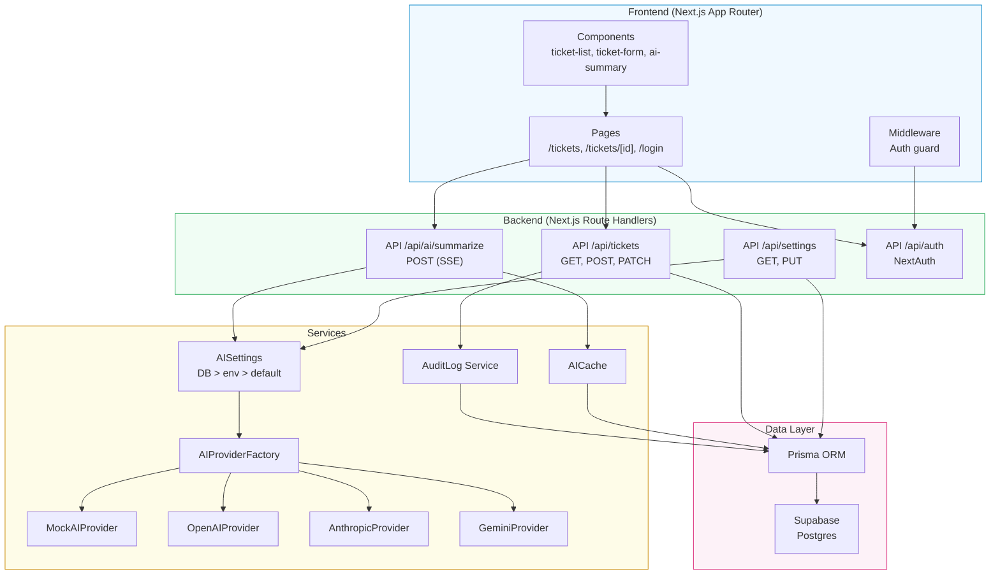

# ARCHITECTURE — Ops Copilot

## Stack

| Camada    | Tecnologia                     | Justificativa                                                                      |
| --------- | ------------------------------ | ---------------------------------------------------------------------------------- |
| Framework | Next.js 14+ (App Router)       | Exigido pelo teste. App Router permite RSC, layouts, route handlers.               |
| Linguagem | TypeScript (strict)            | Exigido. `strict: true` no tsconfig, zero `any`.                                   |
| ORM       | Prisma                         | Type-safety, migrations versionadas, boa DX com Supabase Postgres.                 |
| Banco     | Supabase (Postgres)            | Hosted, zero Docker, connection string simples. Prisma conecta via `DATABASE_URL`. |
| Auth      | NextAuth v4 (Credentials)      | JWT strategy, session handling, CSRF, middleware de proteção de rotas.             |
| UI        | Tailwind CSS + shadcn/ui       | Exigido. Componentes acessíveis, estilo Linear/Vercel.                             |
| Validação | Zod                            | Exigido. Schemas compartilhados entre front e back.                                |
| Testes    | Vitest + React Testing Library | Rápido, ESM nativo, integração natural com Next.js e TypeScript.                   |
| IA        | Multi-provider (plugável)      | OpenAI, Anthropic, Gemini + Mock. Seleção via UI ou env var.                       |
| Config IA | Painel de settings na UI       | API keys, modelos e provider padrão gerenciados via banco (sem redeploy).          |

---

## Estrutura de Pastas

```
ops-copilot/
├── prisma/
│   ├── schema.prisma
│   ├── migrations/
│   └── seed.ts                    # Seed do usuário padrão + tickets de exemplo
├── src/
│   ├── app/
│   │   ├── layout.tsx             # Root layout (providers, fonts, metadata)
│   │   ├── page.tsx               # Redirect para /tickets
│   │   ├── login/
│   │   │   └── page.tsx           # Página de login
│   │   ├── tickets/
│   │   │   ├── page.tsx           # Listagem de tickets
│   │   │   ├── new/
│   │   │   │   └── page.tsx       # Criar ticket
│   │   │   └── [id]/
│   │   │       ├── page.tsx       # Detalhe do ticket
│   │   │       └── edit/
│   │   │           └── page.tsx   # Editar ticket
│   │   ├── settings/
│   │   │   └── page.tsx           # Painel de configuração de IA
│   │   └── api/
│   │       ├── auth/
│   │       │   └── [...nextauth]/
│   │       │       └── route.ts   # NextAuth handler
│   │       ├── settings/
│   │       │   └── route.ts       # GET (config mascarada) + PUT (upsert config)
│   │       ├── tickets/
│   │       │   ├── route.ts       # GET (list) + POST (create)
│   │       │   └── [id]/
│   │       │       └── route.ts   # GET (detail) + PATCH (update)
│   │       └── ai/
│   │           ├── providers/
│   │           │   └── route.ts   # GET (lista providers disponíveis)
│   │           └── summarize/
│   │               └── route.ts   # POST (summarize com SSE)
│   ├── components/
│   │   ├── ui/                    # shadcn/ui components
│   │   ├── tickets/
│   │   │   ├── ticket-list.tsx
│   │   │   ├── ticket-card.tsx
│   │   │   ├── ticket-form.tsx
│   │   │   ├── ticket-filters.tsx
│   │   │   ├── ticket-detail.tsx
│   │   │   ├── status-badge.tsx
│   │   │   └── priority-badge.tsx
│   │   ├── ai/
│   │   │   ├── ai-summary.tsx     # Componente de resumo IA com streaming
│   │   │   └── ai-summary-skeleton.tsx
│   │   ├── audit/
│   │   │   └── audit-timeline.tsx
│   │   └── auth/
│   │       ├── login-form.tsx
│   │       └── auth-guard.tsx
│   ├── lib/
│   │   ├── prisma.ts              # Prisma client singleton
│   │   ├── auth.ts                # NextAuth config
│   │   ├── ai/
│   │   │   ├── types.ts              # AIProvider interface, AIResult, AIStreamChunk
│   │   │   ├── mock-provider.ts      # MockAIProvider (fallback sem API key)
│   │   │   ├── openai-provider.ts    # OpenAIProvider (gpt-4o-mini)
│   │   │   ├── anthropic-provider.ts # AnthropicProvider (claude-haiku-4-5)
│   │   │   ├── gemini-provider.ts    # GeminiProvider (gemini-2.0-flash)
│   │   │   ├── prompt.ts            # System prompt + parser de resultado
│   │   │   ├── settings.ts         # getAISettings() + maskApiKey() — resolve config DB > env > default
│   │   │   ├── factory.ts           # getAIProvider(settings) + getAvailableProviders(settings)
│   │   │   └── cache.ts             # Lógica de cache (get/set/invalidate) com TTL dinâmico
│   │   └── utils.ts               # Helpers genéricos
│   ├── schemas/
│   │   ├── ticket.ts              # Zod schemas para Ticket (create, update, query)
│   │   └── ai.ts                  # Zod schema para summarize input/output
│   ├── types/
│   │   └── index.ts               # Types compartilhados (Ticket, AuditLog, etc.)
│   └── middleware.ts              # NextAuth middleware para proteção de rotas
├── __tests__/
│   ├── lib/
│   │   └── ai/
│   │       ├── mock-provider.test.ts
│   │       ├── factory.test.ts
│   │       └── cache.test.ts
│   ├── schemas/
│   │   ├── ticket.test.ts
│   │   └── ai.test.ts
│   └── api/
│       ├── tickets.test.ts
│       └── ai-summarize.test.ts
├── .env.example
├── vitest.config.ts
├── tsconfig.json
├── tailwind.config.ts
├── next.config.js
├── package.json
└── README.md
```

---

## Modelagem do Banco (Prisma Schema)

```prisma
generator client {
  provider = "prisma-client-js"
}

datasource db {
  provider = "postgresql"
  url      = env("DATABASE_URL")
}

model User {
  id        String   @id @default(cuid())
  email     String   @unique
  password  String   // bcrypt hash
  name      String?
  createdAt DateTime @default(now())

  tickets   Ticket[]
  auditLogs AuditLog[]
}

model Ticket {
  id          String         @id @default(cuid())
  title       String
  description String
  status      TicketStatus   @default(open)
  priority    TicketPriority
  tags        String[]
  createdAt   DateTime       @default(now())
  updatedAt   DateTime       @updatedAt

  userId      String
  user        User           @relation(fields: [userId], references: [id])

  auditLogs   AuditLog[]
  aiCache     AICache?
}

model AuditLog {
  id        String      @id @default(cuid())
  action    AuditAction
  changes   Json        // { field: { from: any, to: any } }
  createdAt DateTime    @default(now())

  ticketId  String
  ticket    Ticket      @relation(fields: [ticketId], references: [id], onDelete: Cascade)
  userId    String
  user      User        @relation(fields: [userId], references: [id])
}

model AICache {
  id        String   @id @default(cuid())
  result    Json     // AIResult
  createdAt DateTime @default(now())
  expiresAt DateTime

  ticketId  String   @unique
  ticket    Ticket   @relation(fields: [ticketId], references: [id], onDelete: Cascade)
}

enum TicketStatus {
  open
  in_progress
  done
}

enum TicketPriority {
  low
  medium
  high
}

model AIConfig {
  id              String   @id @default("singleton")
  defaultProvider String   @default("mock")
  openaiApiKey    String?
  openaiModel     String?
  anthropicApiKey String?
  anthropicModel  String?
  geminiApiKey    String?
  geminiModel     String?
  cacheTtlMs      Int      @default(3600000)
  updatedAt       DateTime @updatedAt
}

enum AuditAction {
  created
  updated
  status_changed
}
```

---

## Padrão AIProvider

### Interface

```typescript
// src/lib/ai/types.ts

export interface AIResult {
  summary: string;
  nextSteps: string[];
  riskLevel: "low" | "medium" | "high";
  categories: string[];
}

export type AIStreamChunk =
  | { type: "chunk"; field: keyof AIResult; content: string }
  | { type: "done"; result: AIResult };

export interface AIProvider {
  generateSummary(input: {
    title: string;
    description: string;
  }): AsyncGenerator<AIStreamChunk>;
}
```

### MockAIProvider

```typescript
// src/lib/ai/mock-provider.ts

export class MockAIProvider implements AIProvider {
  async *generateSummary(input: {
    title: string;
    description: string;
  }): AsyncGenerator<AIStreamChunk> {
    const result = this.buildResult(input);

    // Stream summary em chunks de ~10 palavras
    const summaryChunks = this.chunkText(result.summary, 10);
    for (const chunk of summaryChunks) {
      yield { type: "chunk", field: "summary", content: chunk };
      await this.delay(50 + Math.random() * 50);
    }

    // Stream nextSteps um por um
    for (const step of result.nextSteps) {
      yield { type: "chunk", field: "nextSteps", content: step };
      await this.delay(80 + Math.random() * 40);
    }

    // riskLevel e categories de uma vez
    yield { type: "chunk", field: "riskLevel", content: result.riskLevel };
    yield {
      type: "chunk",
      field: "categories",
      content: JSON.stringify(result.categories),
    };

    yield { type: "done", result };
  }

  private buildResult(input: { title: string; description: string }): AIResult {
    const titleLower = input.title.toLowerCase();
    // Lógica determinística baseada em keywords
    // ... (ver PRD para regras completas)
  }
}
```

### Settings (Configuração Dinâmica)

```typescript
// src/lib/ai/settings.ts

export async function getAISettings(): Promise<AISettings> {
  const config = await prisma.aIConfig.findUnique({ where: { id: "singleton" } });
  return {
    defaultProvider: config?.defaultProvider || process.env.AI_PROVIDER || "mock",
    openaiApiKey: config?.openaiApiKey || process.env.OPENAI_API_KEY || null,
    // ... demais campos com mesmo padrão: DB > env var > default
  };
}
```

A resolução segue a prioridade **DB > env var > default**. Isso permite que o admin configure via UI sem tocar em env vars.

### Factory (Multi-Provider)

```typescript
// src/lib/ai/factory.ts

export function getAvailableProviders(settings: AISettings): string[] {
  // Retorna providers cujas API keys estão configuradas (via DB ou env)
  // Mock está sempre disponível
}

export function getAIProvider(settings: AISettings, provider?: string): AIProvider {
  const selected = provider || settings.defaultProvider;
  // Instancia provider com apiKey e model do settings
}
```

### Seleção via UI

O componente `AISummary` busca `GET /api/ai/providers` para listar providers disponíveis. Um dropdown permite ao usuário escolher qual provider usar. O provider selecionado é enviado no body do `POST /api/ai/summarize` como parâmetro `provider`.

### Painel de Configuração (`/settings`)

Página dedicada para gerenciar a integração de IA sem editar `.env` ou fazer redeploy:
- Provider padrão, API keys (mascaradas na exibição), modelos e cache TTL
- Salva no banco via `PUT /api/settings` (upsert na tabela `AIConfig`)
- API keys mascaradas no `GET /api/settings` (nunca expostas completas)

---

## Autenticação — Fluxo Completo

### NextAuth Config

```typescript
// src/lib/auth.ts

export const authOptions: NextAuthOptions = {
  providers: [
    CredentialsProvider({
      name: "Credentials",
      credentials: {
        email: { label: "Email", type: "email" },
        password: { label: "Senha", type: "password" },
      },
      async authorize(credentials) {
        const user = await prisma.user.findUnique({
          where: { email: credentials?.email },
        });
        if (!user) return null;

        const isValid = await bcrypt.compare(
          credentials!.password,
          user.password,
        );
        if (!isValid) return null;

        return { id: user.id, email: user.email, name: user.name };
      },
    }),
  ],
  session: { strategy: "jwt" },
  pages: { signIn: "/login" },
  callbacks: {
    async jwt({ token, user }) {
      if (user) token.id = user.id;
      return token;
    },
    async session({ session, token }) {
      if (session.user) session.user.id = token.id as string;
      return session;
    },
  },
};
```

### Middleware

```typescript
// src/middleware.ts

export const config = {
  matcher: [
    "/tickets/new",
    "/tickets/:path*/edit",
    "/settings",
    "/api/tickets/:path*",
    "/api/ai/:path*",
    "/api/settings",
  ],
};
```

Nota: O middleware do NextAuth protege todas as rotas no matcher. Para diferenciar GET (público) de POST/PATCH (protegido) nos route handlers, a verificação de session é feita dentro do handler:

```typescript
// Em route handlers que aceitam GET público + POST protegido
export async function POST(request: Request) {
  const session = await getServerSession(authOptions);
  if (!session)
    return NextResponse.json({ error: "Unauthorized" }, { status: 401 });
  // ...
}
```

---

## API Design

### Endpoints

| Método | Rota               | Auth      | Descrição                            |
| ------ | ------------------ | --------- | ------------------------------------ |
| GET    | /api/tickets       | Público   | Listar tickets (paginado)            |
| POST   | /api/tickets       | Protegido | Criar ticket                         |
| GET    | /api/tickets/:id   | Público   | Detalhe do ticket                    |
| PATCH  | /api/tickets/:id   | Protegido | Atualizar ticket                     |
| GET    | /api/ai/providers  | Protegido | Listar providers de IA disponíveis   |
| POST   | /api/ai/summarize  | Protegido | Gerar resumo IA (SSE)                |
| GET    | /api/settings      | Protegido | Config de IA (keys mascaradas)       |
| PUT    | /api/settings      | Protegido | Atualizar config de IA (upsert)      |

### Padrão de Resposta

**Sucesso:**

```json
{ "data": { ... } }
```

**Sucesso (lista):**

```json
{
  "data": [...],
  "pagination": { "page": 1, "limit": 10, "total": 42, "totalPages": 5 }
}
```

**Erro:**

```json
{
  "error": "Mensagem legível",
  "details": { ... }  // Opcional — erros de validação, etc.
}
```

### Zod Schemas Compartilhados

```typescript
// src/schemas/ticket.ts

export const createTicketSchema = z.object({
  title: z.string().min(3, "Título deve ter pelo menos 3 caracteres").max(120),
  description: z
    .string()
    .min(10, "Descrição deve ter pelo menos 10 caracteres")
    .max(5000),
  priority: z.enum(["low", "medium", "high"]),
  tags: z.array(z.string().min(1).max(30)).max(10).default([]),
});

export const updateTicketSchema = z.object({
  title: z.string().min(3).max(120).optional(),
  description: z.string().min(10).max(5000).optional(),
  priority: z.enum(["low", "medium", "high"]).optional(),
  status: z.enum(["open", "in_progress", "done"]).optional(),
  tags: z.array(z.string().min(1).max(30)).max(10).optional(),
});

export const ticketQuerySchema = z.object({
  page: z.coerce.number().int().positive().default(1),
  limit: z.coerce.number().int().min(1).max(50).default(10),
  status: z.enum(["open", "in_progress", "done"]).optional(),
  priority: z.enum(["low", "medium", "high"]).optional(),
  tags: z.string().optional(), // comma-separated, parse depois
  search: z.string().optional(),
  sortBy: z.enum(["createdAt", "updatedAt", "priority"]).default("createdAt"),
  order: z.enum(["asc", "desc"]).default("desc"),
});

// src/schemas/ai.ts — configuração de IA
export const aiConfigSchema = z.object({
  defaultProvider: z.enum(["mock", "openai", "anthropic", "gemini"]).optional(),
  openaiApiKey: z.string().optional().nullable(),
  openaiModel: z.string().max(100).optional().nullable(),
  anthropicApiKey: z.string().optional().nullable(),
  anthropicModel: z.string().max(100).optional().nullable(),
  geminiApiKey: z.string().optional().nullable(),
  geminiModel: z.string().max(100).optional().nullable(),
  cacheTtlMs: z.number().int().min(0).max(86400000).optional(),
});
```

---

## Tratamento de Erros

### Padrão no Backend

```typescript
// Helper para route handlers
function handleApiError(error: unknown): NextResponse {
  if (error instanceof ZodError) {
    return NextResponse.json(
      { error: "Validation failed", details: error.flatten().fieldErrors },
      { status: 400 },
    );
  }
  if (error instanceof NotFoundError) {
    return NextResponse.json({ error: error.message }, { status: 404 });
  }

  return NextResponse.json({ error: "Internal server error" }, { status: 500 });
}
```

### Padrão no Frontend

- Formulários: erro inline por campo (via Zod + React Hook Form ou form state)
- Requisições: toast de erro com mensagem legível
- Páginas: error boundary com opção de retry
- Loading: skeleton components (não spinner genérico)

---

## Estratégia de Testes

### Framework: Vitest + React Testing Library

### O que testar

**1. AIProvider (alta prioridade)**

- `MockAIProvider.generateSummary()` retorna `AIResult` válido
- Streaming emite chunks no formato correto
- Keywords no título influenciam `riskLevel` e `categories`
- Factory retorna `MockAIProvider` por default

**2. Schemas Zod (alta prioridade)**

- `createTicketSchema` aceita input válido
- `createTicketSchema` rejeita input inválido (title curto, description vazio, priority errada)
- `updateTicketSchema` aceita partial updates
- `ticketQuerySchema` aplica defaults corretamente
- `summarizeSchema` aceita `ticketId` OU `{ title, description }`

**3. Route Handlers (média prioridade)**

- `POST /api/tickets` cria ticket e retorna 201
- `POST /api/tickets` retorna 400 com input inválido
- `GET /api/tickets` retorna lista paginada
- `GET /api/tickets?status=open` filtra corretamente
- `PATCH /api/tickets/:id` atualiza e gera audit log
- `POST /api/ai/summarize` retorna stream válido

### Config

```typescript
// vitest.config.ts
import { defineConfig } from "vitest/config";
import path from "path";

export default defineConfig({
  test: {
    environment: "node",
    globals: true,
    setupFiles: ["./tests/setup.ts"],
  },
  resolve: {
    alias: {
      "@": path.resolve(__dirname, "./src"),
    },
  },
});
```

---

## Diagrama de Arquitetura


